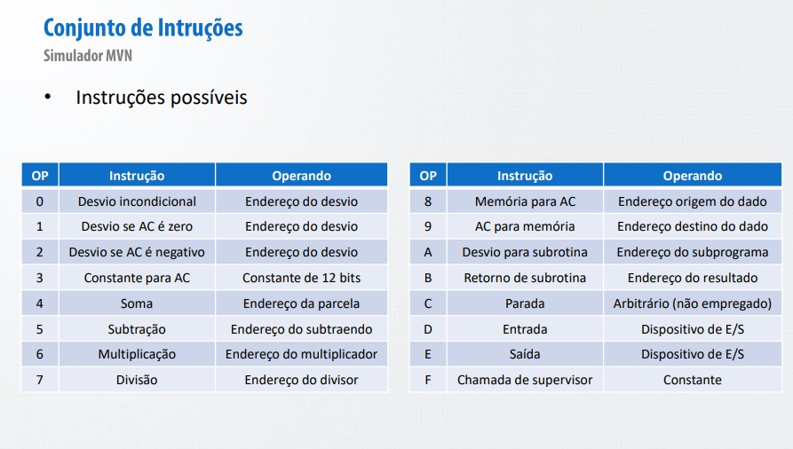

# MVN simulator

## What?

This project is an simulator for an simple processor architecture based on the Von Neumenn Machine. It is an extra simple architecture for a single cycle, 16 instructions, 7 register processor. It contains an MVN module, which runs the code, and an MLR, which is an Mounter, Linker and Relocator, to convert and link assembly files.

The MVN will accept files with the ".mvn" extension and the MLR will accept the ".asm". The MVN executes the code, returning no exit, and the Mounter creates two files, the ".lst", that describe the mounting processes and rotules in the ".asm" file, and an ".mvn", with the code in MVN language, the Linker join different mounted codes and resolve them and the Relocator generate a final code from the linked one, fixing all addresses.

The project also contains the implementation of an monitor to operate all the mechanism simulated in an friendly user interface.

## Motivation

The architecture implemented is used to teach the basics of low level programming to third year students of Computational Engineering from the Polytechnic School of the São Paulo University during the PCS3616-Programming Systems discipline. The use of this language is purely didatic.

## Dependencies

The simulators are coded in Python3, so its obviously required the machine to have an Python3 interpreter.

Besides that, the libraries used are:

- os
- subprocess
- sys

## Directory details

In MVN/ there are two diagrams named logic_diagram.png and class_diagram.png that represent the implemented code. Besides the classes shown at MVN/class_diagram.png (which are each one in separate files homonymous), we have three aditional files, mvnutils.py, containing generic functions used in other files, switchcase.py, that implements a simple switch/case used in many places, and mvnMonitor.py, that contains the interface to run the MVN.

As shown in MVN/logic_diagram.png, the MVN constains 1 LAU, 7 registers, 1 memory and many devices, those are listed and explained below:

### LAU
The LAU in MVN has 6 functions in it:
- is_zero(): this function returns True if the passed argument is 0
- is_neg():this function returns True if the passed argument is lower than 0
- add():return the sum of the two arguments passed
- sub():return the difference of the two arguments passed
- mul():return the product of the two arguments passed
- div():return the integer quocient of the two arguments passed
### Registers
The register have simple functionalities (only gets and sets), they have the following uses:
- MAR: Memory Address Register, it saves the address to be got from the memory
- MDR: Memory Data Register, it saves the value returned from the memory
- IR: Instruction Register, it saves the instruction got at the beggining of each cycle
- OP: OPeration, it saves the operation to be executed at the cycle
- OI: Operand Instruction, it saves the operand of the instruction
- AC: ACmulator, register that is used to save values gotten from various places
- IC: Instruction Counter, it is used to save the address of the next instruction
### Memory
The MVN memory is composed of 0xFFF addresses, the address work the same way as the registers, and can be accessed by pairs of addresses.
### Devices
The devices to be accessed for I/O are of 4 types: keyboard, screen, files and printer. To pre-inicialize the devices list you can set the "disp.lst" file as below:
[type] [UC] [file_name] [rwb] [printer_name]
#### type:
- 0:keyboard
- 1:screen
- 2:file
- 3:printer
#### UC:
It's the Unit Code, it's an unique number for each device in each type
#### file_name (optional):
Only to be set when type=2, it's the name of the file to be read/writen
#### rwb:
Only to be set when type=2, it's the mode to open the file
- e:to be writen
- l:to be read
- b:both
#### printer_name:
Only to be set when type=3, it's the printer name on the system

## Programming

### To MVN

The MVN accepts 16 instructions, those are:

| OPCODE | MNEMONIC | function |
| --- | --- | --- |
| 0 | JP |Jumps to the operand address |
| 1 | JZ |Jumps to the operand address if AC is 0 |
| 2 | JN |Jumps to the operand address if AC is negative |
| 3 | LV |Load the operand to AC |
| 4 | AD |Save in AC the value AC+value stored in operand address |
| 5 | SB |Save in AC the value AC-value stored in operand address |
| 6 | ML |Save in AC the value AC*value stored in operand address |
| 7 | DV |Save in AC the value AC/value stored in operand address |
| 8 | LD |Save in AC the value stored in operand address |
| 9 | MM |Save in the operand address the value AC |
| A | SC |Call subroutine in operand address |
| B | RS |Return the subroutine that started in operand address |
| C | HM |Halt machine |
| D | GD |Save in AC a pair of nibbles from operand device |
| E | PD |Send value in AC to operand device |
| F | SO |Calls the supervisor to deal with specific codes, which are given by the operand |



For coding to the MVN, you may write a file (extension ".mvn" preferably) that discribes the inicial state of the memory. To do that you have to set the content of one pair of addresses per line, that is done the following way:

```
XXXX IPPP ;this is a comment
```

Each X, I and P are representing nibbles.

XXXX is the address you're setting, it's value is between 0x0000 and 0x0FFF.

IPPP is the value to be stored in the address, it's between 0x0000 and 0xFFFF, the most significant nibble, I, is the instruction to be executed and the other three, PPP, is the operand.

The supervisor operand is interpreted as follows:

```
XXXX FAOO
```

XXXX is the address, F is the instruction for the supervisor, A is the number os arguments to be passed and OO is the operation the supervisor must execute. The only operations implemented for supervisor are 0xEE, which prints error messages depending on the value on the acumulator, 0xEF, which runs an secondary code in memory and returns main execution when it halts, and 0x57, which operates the staack (full decription above). The arguments are written in the lines preceeding. Hence the code with 2 arguments should look like:

```
0AAA 0XXX
0BBB VAL1
0CCC VAL2
0XXX F2OO
```

The stack implemented has its stack pointer (SP) is in address 0x0ffe. To use the stack you should use the OS function, the code (passed via AC) 0 will place SP in AC, 1 will place AC in SP, 2 will place the value stored in STPTR address in AC and 3 will place AC in SP address.

There is also a "mvn.config" file you can set to configure the infinite loop prevention. The code will exit after the number of steps taken exceed max_step (default to 10000), to set it in config file, write a line like: "max_step=[value]" where value is the number of max_step you want to set.

One last functionality implemented in MVN is an Time Interruption, there is an internal variable called NUM (hardcoded to 50), which represents the time (counted as number of steps) between interruptions, during execution another varible keeps is incremented at each step and, when it reaches NUM, it is made an subroutine call to address 0x000, at this position must be implemented an Interruption Handler.

### To MLR

The MLR stands for Mounter, Linker and Relocator, it contains 3 codes which gives support for a new language (ASM) to be translated to MVN, the operations allowed in ASM are the same as the ones in MVN, but now you should use the mnemonics to refer to it. More tham that, now you don't have to write the memory address for each instruction, these will be automatically generated, and you can define rotules for each line.

There is a set o psedo-instructions that can also be used while coding:

| SYMBOL | USE | function |
| --- | --- | --- |
| > | > rotule | this represents an entry point, this will make rotule (which must be defined in the code) usable by other codes |
| < | < rotule | thie represents an external, this will import an entry point from another code to be used |
| @ | @ addr | this defines the following code as fixed in addr |
| & | & addr | this defines the following code as relocable in addr |
| K | K value | this defines a constant with value as value |
| $ | $ value | this reserver value memory space |
| # | # | represents the end of the code, must be the final line of any ASM code |

A general line coded in ASM is as the following:

```
rotule 		operation 		operand
```

"rotule" is any string you want, optional.

"operation" is any of the instructions or pseudo-instructions.

"operand" is either a rotule or and value.

Writing fixed values offers some options, before the value there must be placed some identifier that represents the type of value:
- "/": hexadecimal value
- "=": decimal values
- "@": octal values
- "#": binary balues
- "'": ASCII values

## Executing

### MVN

To execute the simulator you can either deal with the MVN purely or use the mvnMonitor.

To run the MVN purely you should open the Python3 terminal and import the MVN class, as following:

```
cd MVN/
python3
import MVN
#From now own you need to read the code and crack how to use the functions alone
```

To use the mvnMonitor you can run it with Python3 directly or open an Python3 terminal an import it (this way you get the monitor properties), as following:

```
cd MVN/

#Running purely
python3 mvnMonitor

#Running with terminal
python3
import mvnMonitor
```

### MLR

Each of the functions on MLR have it's own separate script, hence you should run one of them at a time.

Mounter:

```
python3 montador.py file_in.asm file_out.mvn
```

Where file_in.asm is you ASM code and file_out.mvn is the file to be generated.

Linker:

```
python3 ligador.py file_in1.mvn [file_in2.mvn ... file_inn.mvn] file_out.mvn
```

Where file_ink.mvn is each one of the MOUNTED files to be linked and file_out.mvn is the file to be generated.

Relocator:

```
python3 relocador.py file_in.mvn file_out.mvn
```

Where file_in.mvn is the linked final code and file_out.mvn is the file to be generated.